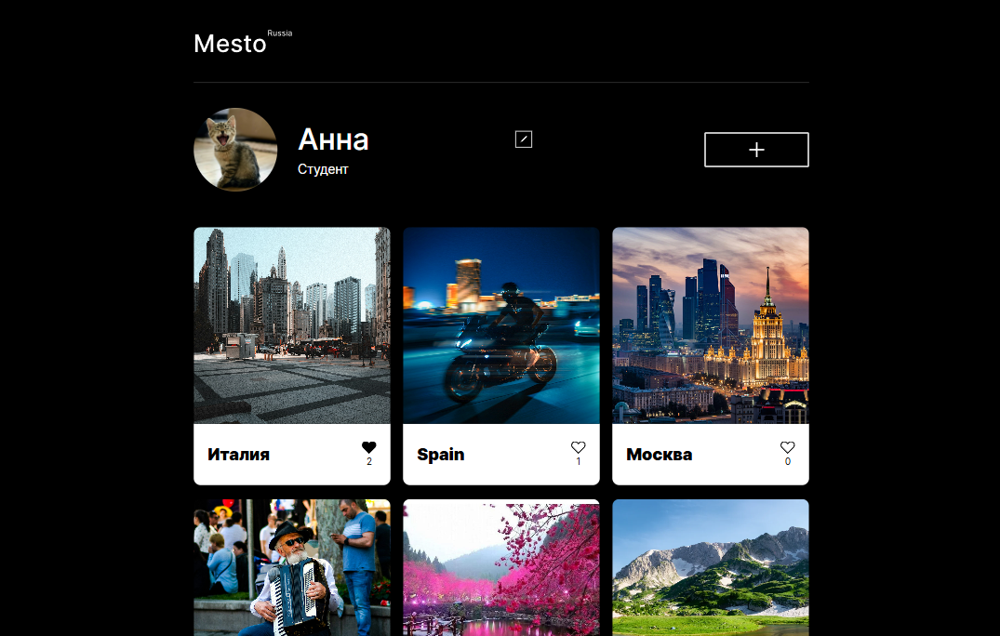

# Интерактивная галерея «Mesto»

«Mesto» — это интерактивная веб-страница, где пользователи могут загружать изображения, ставить лайки и удалять публикации. Проект также позволяет редактировать профиль пользователя и просматривать увеличенные изображения, при этом данные хранятся и синхронизируются с сервером.

Проект разработан для освоения ключевых концепций JavaScript, таких как типы данных, условия, циклы и функции, работа с DOM и обработка событий. В процессе разработки реализовано взаимодействие с сервером методами API, валидация форм с использованием регулярных выражений, а также модульная структура проекта с применением сборщика Webpack.

[Сайт на github-pages](https://anna-kobis.github.io/mesto/) | Макеты в Figma: [Лейаут и ui-kit](https://www.figma.com/design/bjyvbKKJN2naO0ucURl2Z0/) | [Валидация форм](https://www.figma.com/design/kRVLKwYG3d1HGLvh7JFWRT/) | [Лайки и модальные окна](https://www.figma.com/design/PSdQFRHoxXJFs2FH8IXViF/)



## Функционал приложения

- Отображение данных: загрузка и отображение данных пользователя и карточек с сервера.
- Редактирование профиля: открытие модального окна, заполнение данными, сохранение изменений на сервере.
- Редактирование аватара: открытие модального окна при наведении, загрузка нового аватара и обновление на странице.
- Добавление карточек: открытие модального окна, заполнение формы, добавление новой карточки на сервер и на страницу.
- Лайки: изменение состояния кнопки лайка при клике, обновление счетчика лайков.
- Удаление карточек: удаление собственных карточек с сервера и со страницы.
- Просмотр карточек: открытие модального окна с увеличенным изображением и подписью карточки.
- Модальные окна: плавное открытие и закрытие модальных окон по клику на крестик, оверлей и Esc.
- Валидация форм: кастомные сообщения об ошибках, динамическое управление состоянием кнопки отправки.
- Адаптивность: корректное отображение на различных устройствах.

## Стек технологий

- Верстка на HTML5 и CSS3.
- Скрипты на JavaScript (ES6+).
- Сборка на Webpack с траспиляцией JS с Babel и обработкой CSS с PostCSS, включая минификацию и проставление вендорных префиксов.
- Для управления зависимостями использовался npm, для деплоя на GitHub Pages - gh-pages.

## Установка, запуск, сборка

1. Для начала работы необходимо клонировать репозиторий проекта с помощью следующей команды в терминале:

```bash
git clone https://github.com/anna-kobis/mesto.git
```

2. Перейдите в директорию с проектом и установите необходимые зависимости с помощью команды:

```bash
npm install
```

3. Для запуска проекта в режиме разработки используйте команду:

```bash
npm run dev
```

Эта команда запустит локальный сервер и автоматически откроет проект в браузере.

4. Для сборки проекта в продакшен-режиме выполните команду:

```bash
npm run build
```

Собранные файлы будут помещены в папку `dist`.

5. Для деплоя проекта на GitHub Pages можно выполнить команду:

```bash
npm run deploy
```

Эта команда автоматически соберет проект и опубликует его на GitHub Pages.

Для публикации необходимо создать удаленный репозиторий на вашем аккаунте GitHub и связать его с вашим локальным репозиторием.
